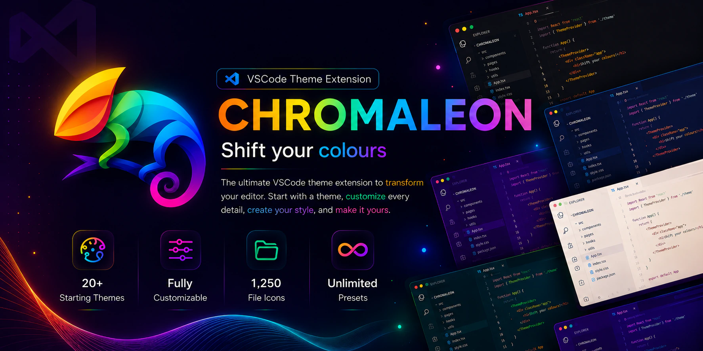
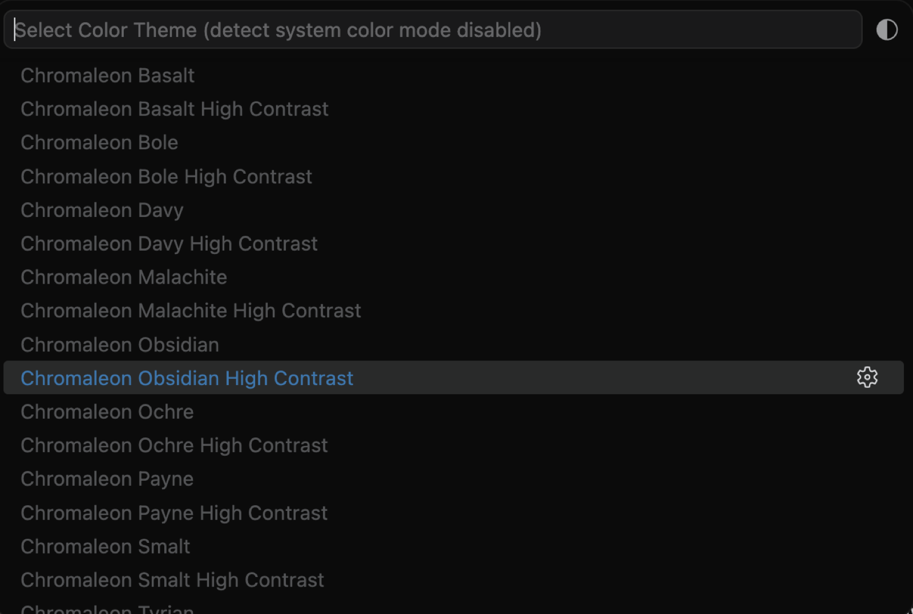
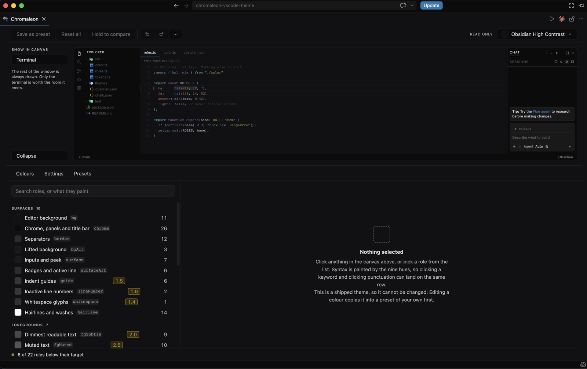
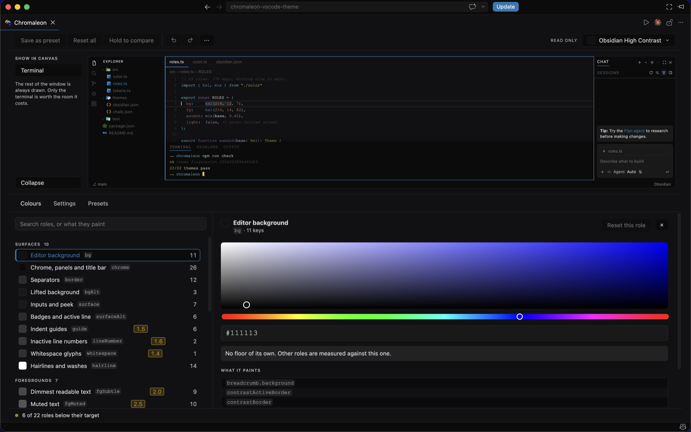
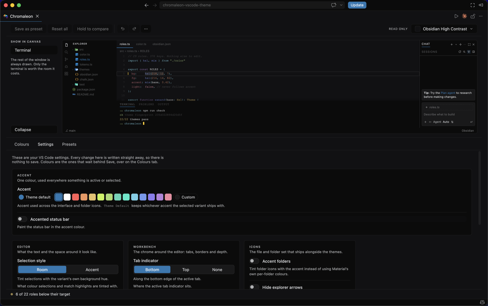
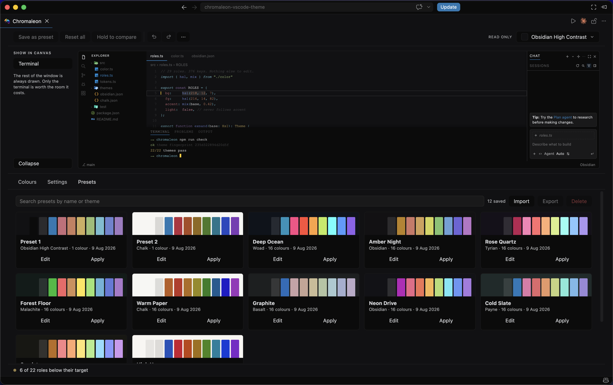
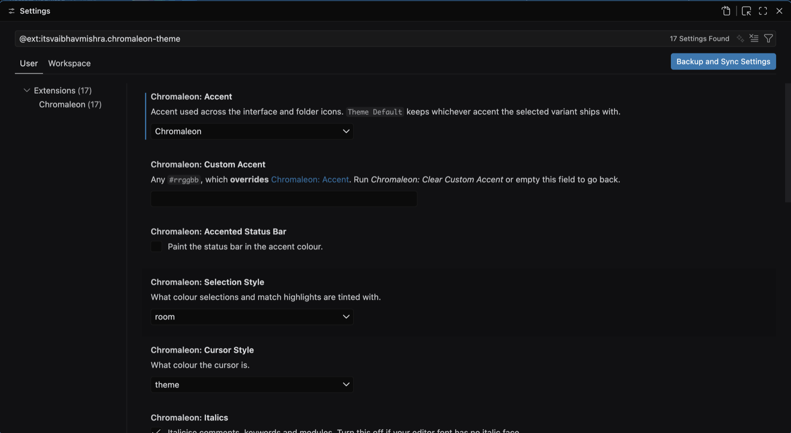

<div align="center">
  
</div>

<br/>

> **Please leave a ⭐ if you like this project**

<br/>

**The last colour theme you will ever need.**

Chromaleon ships 22 themes, dark and light, with a high contrast variant of each and a matching
file icon theme. That is where you start, not where you stop.

Every colour in the editor is one of 29 roles, and the **customizer** hands you all of them.
Change any one against a live miniature of your own window, and keep the result as a preset.
Nudge a shipped theme until it feels like yours, or build something nobody has seen.

One extension, and as many themes as you care to make.


## Contents

- [Install](#install)
- [Get started](#get-started)
- [The customizer](#the-customizer)
- [The 22 starting points](#the-22-starting-points)
- [Icons](#icons)
- [Settings](#settings)
- [Commands](#commands)
- [Development](#development)

## Install

Search **Chromaleon** in the Extensions view, or:

```
ext install itsvaibhavmishra.chromaleon-theme
```

An untouched install writes **nothing** to your `settings.json`. Lines appear only once you move
something off its default, and they are scoped to the active theme.

## Get started

### 1. Pick a starting point

`⌘K ⌘T` on macOS, `Ctrl+K Ctrl+T` elsewhere. Variants are ordered darkest first, so the picker
reads as a gradient.



### 2. Open the customizer

Run **Chromaleon: Open Customizer** from the command palette. The panel opens with a miniature of
your window on top and every editable colour below it.



The miniature is a **map as well as a preview**. Click any region in it and the panel jumps to the
role that paints it, so you never need to know a VS Code colour key to change what you are looking
at. Pick a role instead and every region it touches lights up.

### 3. Change a colour, keep it as a preset

Pick a role, move the colour, press **Save**.



Each role shows what it reads at against its contrast floor, with a one-click fix that moves
lightness only, so the hue survives.

Edits are a draft. Nothing reaches VS Code until you press Save, and undo and redo (`⌘Z`, `⌘⇧Z`)
walk the whole session. **A shipped theme is never written to**: editing one copies it into a
preset of your own first, so the 22 stay exactly as the build made them.

## The customizer

Three tabs.

### Colours

All 29 roles and what each one paints, against the live miniature. Search by role name or by what
it paints, so "the bit behind the tabs" finds it without knowing it is called `chrome`.

### Settings

The same settings VS Code exposes, laid out with the miniature reflecting them as you go. These
write straight away, so there is nothing to save.



### Presets

Everything you have made, with what it is built on and when you saved it. Search them, apply or
delete in bulk, and hold the eye on any card to see it in the miniature without applying it.



**Import and Export** move presets between machines as `.json` files, one or many at a time. A file
that is not ours, is truncated, or was made by a newer format says so rather than failing quietly.
An import identical to something already saved is flagged rather than duplicated.

## The 22 starting points

Named after historical pigments and minerals, ordered darkest first. Every variant ships a **High
Contrast** version alongside it, where the editor background never moves: contrast comes from
separating the regions around your code, not from dimming the code itself.

| Variant       | Background         | Named after                        |
| :------------ | :----------------- | :--------------------------------- |
| **Obsidian**  | near black         | volcanic glass                     |
| **Tyrian**    | purple             | Tyrian purple, the murex-shell dye |
| **Ochre**     | warm neutral       | the oldest pigment there is        |
| **Malachite** | green              | the copper carbonate mineral       |
| **Woad**      | deep blue-violet   | the blue dye plant                 |
| **Bole**      | warm red-neutral   | red clay used under gold leaf      |
| **Basalt**    | cool grey          | the volcanic rock                  |
| **Davy**      | pure neutral       | Davy's grey, ground slate          |
| **Payne**     | blue-grey          | Payne's grey, the mixed neutral    |
| **Smalt**     | lifted blue-violet | powdered cobalt glass              |
| **Chalk**     | light              | the white earth pigment            |

Every one is **readable by construction**. The build refuses to ship a theme whose body text drops
below 7:1, whose syntax colours fall under 3.5:1, or whose accent cannot carry legible text. Chalk's
neutrals are solved to land on the same contrast ratios the dark variants hit, so the family reads
as one system rather than a dark theme with a light cousin.

## Icons

**1,250 file and folder icons** with 13,017 associations, from
[Material Icon Theme](https://github.com/material-extensions/vscode-material-icon-theme) (MIT),
consumed as an npm dependency rather than vendored so the version and licence stay tracked.
Attribution ships inside the extension in [THIRD-PARTY-NOTICES.md](THIRD-PARTY-NOTICES.md).

Folders keep Material's own colours by default. Turn on `accentFolders` and they recolour to your
accent, preserving the pale glyph that sits on the folder face.

## Settings

All under `chromaleon.*`. Run **Chromaleon: Open Settings** to jump straight there, or change them
on the customizer's Settings tab and watch the miniature.



<details>
<summary><b>All 15 settings</b></summary>

<br/>

| Setting              | Default         | Effect                                                |
| :------------------- | :-------------- | :---------------------------------------------------- |
| `accent`             | `Theme Default` | Accent across the UI and folder icons                 |
| `customAccent`       | _empty_         | Any `#rrggbb`, overrides `accent`                     |
| `accentedStatusBar`  | `false`         | Paint the status bar in the accent                    |
| `selectionStyle`     | `room`          | Tint selections with the variant's hue, or the accent |
| `cursorStyle`        | `theme`         | Cursor in the theme's own colour, or the accent       |
| `italics`            | `true`          | Italicise comments, keywords and modules              |
| `currentLine`        | `outline`       | `outline`, `solid` or `none`                          |
| `tabIndicator`       | `bottom`        | `bottom`, `top` or `none`                             |
| `tabBar`             | `flat`          | `flat`, or `contrasted` for a darker bar              |
| `borders`            | `none`          | `none`, `subtle` or `strong`                          |
| `shadows`            | `true`          | Shadows under widgets and overlays                    |
| `accentFolders`      | `false`         | Tint folder icons with the accent                     |
| `hideExplorerArrows` | `false`         | Hide the chevrons beside folders                      |
| `syncIconTheme`      | `true`          | Switch to Chromaleon Icons automatically              |
| `customizerLocation` | `newWindow`     | Where Open Customizer puts the panel                  |

</details>

Your presets are stored under `chromaleon.presets` and `chromaleon.activePresets`. They are plain
JSON, so they can be read and edited by hand; the panel drops anything that is not a `#rrggbb`
rather than failing.

**Only our own keys are removed.** The extension records what it wrote and removes exactly that, so
hand-written `colorCustomizations` survive.

## Commands

| Command                             | What it does                                      |
| :---------------------------------- | :------------------------------------------------ |
| **Chromaleon: Open Customizer**     | The panel: colours, settings and presets          |
| **Chromaleon: Select Accent**       | Pick an accent without opening the panel          |
| **Chromaleon: Clear Custom Accent** | Drop a custom hex and go back to the named accent |
| **Chromaleon: Open Settings**       | Jump to Chromaleon's settings                     |
| **Chromaleon: Reset All Settings**  | Put every setting back to its default             |

**Open Customizer** and **Open Settings** are also on Chromaleon's own row in the Extensions view,
under the gear menu, so you never have to remember a command name.

## Development

Themes are generated rather than hand-written, and the build audits every contrast floor before it
will ship one. See [docs/development.md](docs/development.md) for how that works, how to build, and
how to add a variant.

## License

[MIT](LICENSE.txt)
