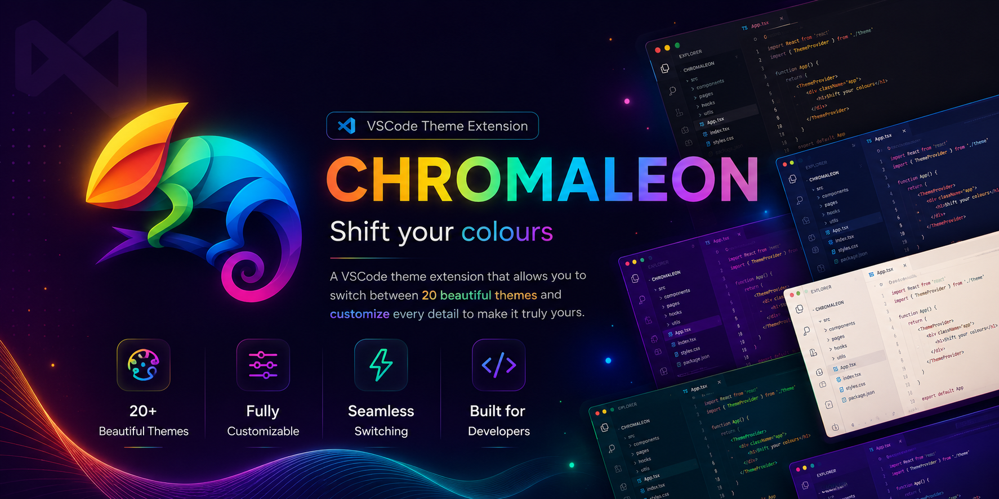

<div align="center">
  
</div>

<br/>

> [!IMPORTANT]
> Please leave a ⭐ if you like this project

<br/>

Chromaleon is a set of eleven themes for VS Code, ten dark and one light, each with a high
contrast pair and a matching file icon theme. Pick a background that suits the room, then
**shift the accent to any colour you like** and watch the whole interface follow, icons
included.


## 🎨 Themes

Eleven variants, named after historical pigments and minerals, ordered darkest first so the
theme picker reads as a gradient. Every one ships a **High Contrast** pair.

| Variant       | Background         | Named after                        |
| :------------ | :----------------- | :--------------------------------- |
| **Obsidian**  | near black         | volcanic glass                     |
| **Tyrian**    | purple             | Tyrian purple, the murex-shell dye |
| **Ochre**     | warm neutral       | the oldest pigment there is        |
| **Malachite** | green              | the copper carbonate mineral       |
| **Woad**      | deep blue-violet   | the blue dye plant                 |
| **Bole**      | warm red-neutral   | red clay used under gold leaf      |
| **Basalt**    | cool grey          | the volcanic rock                  |
| **Davy**      | pure neutral       | Davy's grey, ground slate          |
| **Payne**     | blue-grey          | Payne's grey, the mixed neutral    |
| **Smalt**     | lifted blue-violet | powdered cobalt glass              |

## ✨ Features

- **One accent, everywhere** - pick from 14 accents or type any hex, and all 57 accent-carrying
  colours repaint together, including folder icons.
- **Readable by construction** - the build refuses to ship a theme whose body text drops below
  7:1, whose syntax colours fall under 3.5:1, or whose accent cannot carry legible text.
- **A high contrast pair for every variant** - the editor background never moves. Contrast comes
  from separating the regions around your code, not from dimming the code itself.
- **Light and dark share one set of proportions** - Chalk's neutrals are solved to land on the
  same contrast ratios the dark variants hit, so the family reads as one system.
- **1,250 file and folder icons** with 13,017 associations, from Material Icon Theme.
- **Nothing written until you change something** - an untouched install adds zero lines to your
  `settings.json`, and what it does write is scoped to the active theme.
- **Fourteen settings** covering the status bar, selections, cursor, current line, tabs,
  borders, shadows, italics and folder tinting.

## ⚙️ Settings

All under `chromaleon.*`. Run **Chromaleon: Open Settings** to jump straight there.

| Setting             | Default         | Effect                                                |
| :------------------ | :-------------- | :---------------------------------------------------- |
| `accent`            | `Theme Default` | Accent across the UI and folder icons                 |
| `customAccent`      | _empty_         | Any `#rrggbb`, overrides `accent`                     |
| `accentedStatusBar` | `false`         | Paint the status bar in the accent                    |
| `selectionStyle`    | `room`          | Tint selections with the variant's hue, or the accent |
| `cursorStyle`       | `theme`         | Cursor in the theme's own colour, or the accent       |
| `italics`           | `true`          | Italicise comments, keywords and modules              |
| `currentLine`       | `outline`       | `outline`, `solid` or `none`                          |
| `tabIndicator`      | `bottom`        | `bottom`, `top` or `none`                             |
| `tabBar`            | `flat`          | `flat`, or `contrasted` for a darker bar              |
| `borders`           | `none`          | `none`, `subtle` or `strong`                          |
| `shadows`           | `true`          | Shadows under widgets and overlays                    |
| `accentFolders`     | `false`         | Tint folder icons with the accent                     |
| `explorerArrows`    | `false`         | Show chevrons beside folders                          |
| `syncIconTheme`     | `true`          | Switch to Chromaleon Icons automatically              |

Commands: **Select Accent**, **Clear Custom Accent**, **Open Settings**, **Reset All Settings**.

Two things worth knowing about how settings apply:

- **An untouched install writes nothing.** Overrides only reach your `settings.json` once you
  move something off its default, and they are scoped to the active theme.
- **Only our own keys are removed.** The extension records what it wrote and removes exactly
  that, so hand-written `colorCustomizations` survive.

## 🖼️ Icons

File and folder icons come from
[Material Icon Theme](https://github.com/material-extensions/vscode-material-icon-theme) (MIT),
consumed as an npm dependency rather than vendored so the version and licence stay tracked.
Attribution ships inside the extension in [THIRD-PARTY-NOTICES.md](THIRD-PARTY-NOTICES.md).

Folders keep Material's own colours by default. Turn on `accentFolders` and they recolour to
your accent, preserving the pale glyph that sits on the folder face.

## 💻 Tech Stack


## 🧬 How it works

Themes are **generated, not hand-written**. A variant declares three values and the build
expands them into 279 workbench colour keys, 81 TextMate rules and 18 semantic tokens.

```
src/core/        colour maths, Palette type, accents (pure, no vscode, no fs)
src/theme/       variants, workbench/token/semantic maps, high-contrast transform
src/icons/       Material icon ingest + accent recolouring
src/extension/   extension-host runtime (settings, colours, italics, icons, ledger)
src/scripts/     build, check, lock
```

Three properties fall out of that:

- **The manifest cannot drift.** `contributes.themes` and `contributes.iconThemes` are rewritten
  by the build from the variant list. You never edit them.
- **Contrast is structural.** Every neutral is a fixed step along `bg -> fg`, so a new variant
  inherits the same contrast relationships instead of needing them re-tuned by eye.
- **The runtime cannot fall out of step.** Which colour keys carry the accent is _discovered_ at
  build time by rendering the mapping with sentinel colours. Add an accent-coloured key and the
  accent setting picks it up with no second list to update.

## 🛠️ Build

The repo carries **source only**. `themes/`, `icons/`, `dist/` and `src/generated.ts` are all
build output and gitignored. [`src/theme-lock.json`](src/theme-lock.json) fingerprints what the
build must produce, so a fresh clone is verifiably identical rather than merely present.

```bash
npm install
npm run build              # required after cloning, nothing is generated yet
npm run check              # build + audits + typecheck + lint + format + tests
npm test                   # settings tests only
npm run package            # produce a .vsix
npm run lock               # re-record the fingerprint (intended visual changes only)
```

`npm run check` fails on:

- The generated themes differing from the fingerprint. Refactors must be visually neutral.
- Body text below 7:1, or a meaning-carrying syntax colour below 3.5:1.
- An accent below 3:1 on its background, or on-accent text below 4.5:1.
- A high contrast pair brightening in-editor texture rather than separating regions.
- An icon theme with a missing SVG or an association pointing at nothing.

Then 37 assertions run the built bundle against a stubbed `vscode` module and check what each
setting actually does. Pass an extension directory to test an installed copy:

```bash
node test/settings.cjs ~/.vscode/extensions/<id>
```

## 🎯 Adding a variant

Append to `VARIANTS` in [`src/theme/variants.ts`](src/theme/variants.ts):

```ts
defineVariant({ name: 'Ember', bg: [18, 22, 10], fg: [24, 26] }),
// or a light one, where every derivation flips direction:
defineVariant({ name: 'Vellum', bg: [42, 26, 95], fg: [30, 20], light: true }),
```

Then `npm run check`. That produces `Chromaleon Ember` and `Chromaleon Ember High Contrast`,
registers both in the manifest, and verifies every contrast floor.

## 📄 License

[MIT](LICENSE.txt)

<br/>

<div align="center">

</div>

<br/>

---
